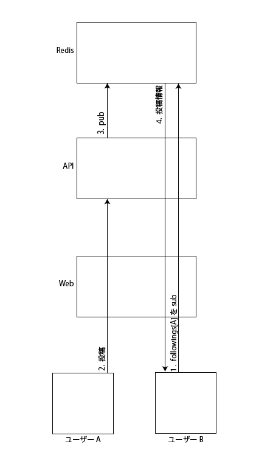

# streaming-timeline-test
ユーザーをフォローして、タイムラインにその投稿をストリーミングで流す模擬的なテスト

## 依存環境
- node
- npm
- redis

## 起動
1. `git clone git@github.com:marihachi/streaming-timeline-test.git`
2. `cd streaming-timeline-test`
3. `npm install`
4. `npm run start`

## 構成イメージ

